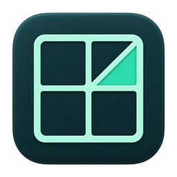

# PonGrid

すべてのモニターに、自分だけのグリッドを。

PonGridは、画面全体に目盛りを重ねるmacOSのメニューバーアプリです。グリッドはクリックを通すため、いつものアプリをそのまま操作できます。

## 主な機能

- モニターごとに表示・形・細かさ・線の色や太さを設定し、自動保存。
- 四角、三角、四角＋対角線の3種類。
- ポインタがある面や周辺の線をハイライト。周辺の線を徐々に透過するモードも用意。
- 設定画面とメニューバーのクイック設定にLiquid Glassを採用。
- アプリ内で更新確認と自動チェックのON/OFF。インストール前に確認します。

## ダウンロード

初回配布の準備中です。公開後、[Releases](https://github.com/Tackrow/PonGrid/releases)からダウンロードできます。

macOS 14以降。Apple Silicon / Intelの両方に対応。Liquid GlassはmacOS 26以降で使用し、macOS 14・15では半透明の表示になります。

## 使い方

アプリを起動し、モニターごとに設定します。設定画面を閉じても常駐します。メニューバーのアイコンから一括表示やモニター別スイッチを操作できます。

アプリの「アップデートと応援」から、更新確認と終了時の応援案内のON/OFFを設定できます。

## 開発を応援

PonGridが役に立ったら、[Buy Me a Coffee](https://buymeacoffee.com/atureal)で開発を応援していただけると嬉しいです。応援は任意です。

## このリポジトリについて

ここは配布用リポジトリです。アプリ、更新情報、配布案内を提供します。ソースコードは別の非公開リポジトリで管理しています。

不具合報告にはmacOSのバージョン、PonGridのバージョン、モニター構成、再現手順を添えてください。
